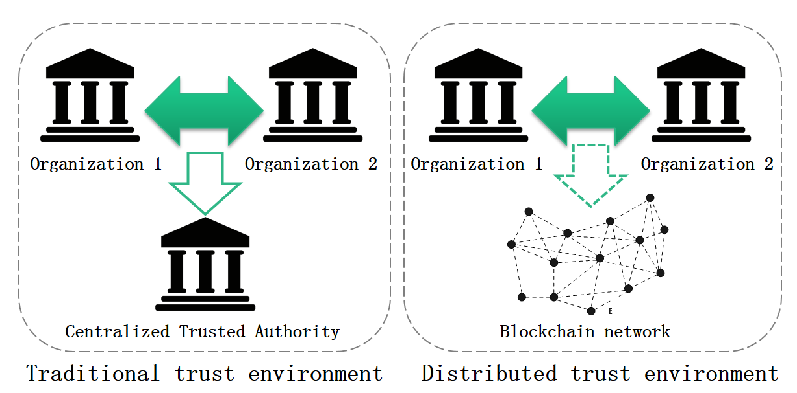
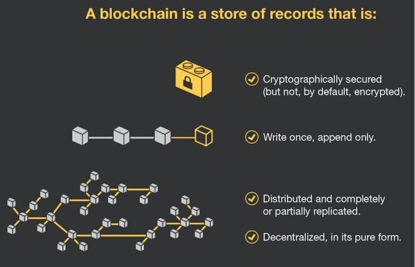
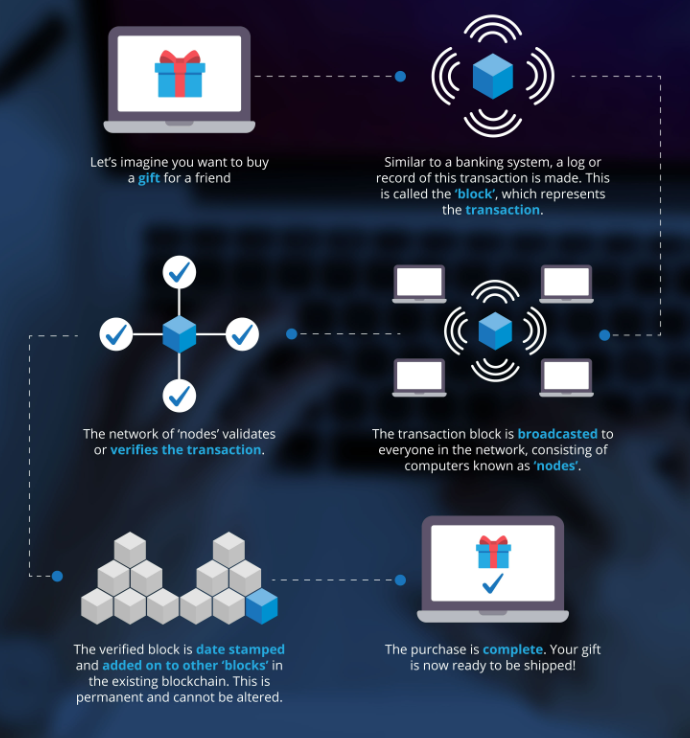
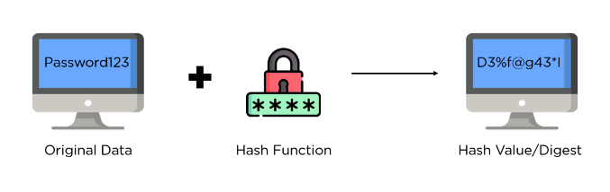

# Blockchain and Cryptocurrency in Java

> Blockchain is a peer-to-peer decentralized distributed ledger technology that makes the records of any digital asset
> transparent and unchangeable and works without involving any third-party intermediary.

In simpler words, the blockchain is an **immutable** (unchangeable, meaning a transaction or file recorded cannot be
changed) distributed digital **ledger** (digital record of transactions or data stored in multiple places on a computer
network).

An **asset** can be tangible (a house, car, cash, land) or intangible (intellectual property, patents, copyrights,
branding). Virtually anything of value can be tracked and traded on a blockchain network, reducing risk and cutting
costs for all involved.

> A cryptocurrency is a digital currency designed to work as a medium of exchange through a computer network that is
> not reliant on any central authority, such as a government or bank, to uphold or maintain it.
> It is a decentralized system for verifying that the parties to a transaction have the money they claim to have,
> eliminating the need for traditional intermediaries, such as banks, when funds are being transferred between
> two entities.

In simpler words, cryptocurrency is a digital or virtual currency that is secured by **cryptography**, which makes it
nearly impossible to counterfeit or double-spend. Many cryptocurrencies are decentralized networks based on blockchain
technology — a distributed ledger enforced by a disparate network of computers.

## Table of contents

### Part I - Blockchain

1. Blockchain - The Big Picture
    - Blockchain Demystified
    - How does Blockchain work
    - Bitcoin example
    - Key elements of a Blockchain
    - Disadvantages of a Blockchain
2. IntelliJ Project Setup
3. Hash Function
4. The Ledger
5. Public keys, Secret Keys and Digital Signature
6. Blockchain - Mining
7. Consensus Protocol
8. Byzantine Generals Problem
9. Proof-Of-Work (PoW)
10. Proof-Of-Stake (PoS)
11. Blockchain Implementations

### Part II - Cryptocurrency

1. Cryptocurrency - The Big Picture
2. History of currency
3. The Forex Market
4. Mempools

_work_in_progress_

### Youtube

[Blockchain and Cryptocurrency in Java playlist](https://www.youtube.com/playlist?list=PLQDzPczdXrTjU7O6HAKDgm_mLvlDqFl3Y)

---

## Part I - Blockchain

### Chapter 01 - Blockchain - The Big Picture

#### Blockchain Demystified

Suppose I want to buy a computer from one of my colleague in my office. The colleague wants to sell it as she is moving
to other location. So, to make the transaction (buying and selling) - normal procedure is to have a centralized third
party system (like banks) where the transaction can be recorded, i.e. money transferred from my account to her account.
This transaction will be recorded as bank statements in my account and her credited bank account.

Imagine a world where I can send money directly to my colleague without a bank – in seconds instead of days, and I don’t
pay any exorbitant bank fees.

Or one where I store money in an online wallet not tied to a bank, meaning I am my own bank and have complete control
over my money. I don’t need a bank’s permission to access or move it, and never have to worry about a third party taking
it away, or a government’s economic policy manipulating it.

This is not a world of the future; it is a world that an avid but growing number of early adopters live in right now.
And these are just a few of the important blockchain technology use cases that are transforming the way we trust and
exchange value.

Blockchain technology wants to get rid of this centralized systems and make the whole transaction decentralized and
distributed. A decentralized network offers multiple benefits over the traditional centralized network, including
increased system reliability and privacy. Moreover, such networks are much easier to scale and deal with no real single
point of failure. The reason why Blockchain is distributed is because of shared communication and distributed
processing.

So me and my colleague can do the transaction in the blockchain network of computer buyers and sellers. Blockchain is
a **trust-less** system without any third party => the blockchain itself guarantees trust.

Immutable and distributed are two fundamental blockchain properties. The immutability of the ledger means we can always
trust it to be accurate. Being distributed protects the blockchain from network attacks.

#### How does Blockchain work

In simpler words, a Blockchain is a continuous growing list of records called **blocks** that are linked and secured
using cryptography.

Blockchain is the underlying technology and data structure of cryptocurrencies where we store transactions in the block.

Each transaction or record on the ledger is stored in a **“block”**. For example, blocks on the Bitcoin blockchain
consist of an average of more than 500 Bitcoin transactions.

The information contained in a block is dependent on and linked to the information in a previous block and, over time,
forms a chain of transactions. Hence, the word **blockchain**.

#### Bitcoin example

Here’s how this process works with **Bitcoin**. When sending Bitcoin, we pay a small fee (in bitcoin) for a network of
computers to confirm our transaction is valid. Our transaction is then bundled with other transactions pending in a
queue to be added to a new block.

The computers (nodes) then work to validate this list of transactions in the block by solving a complex mathematical
problem to come up with a **hash**, which is a 64-digit hexadecimal number.

Once solved, the block is added to the network—and our fee, combined with all other transaction fees in that block, is
the miner’s reward.

Each new block added to the network is assigned a unique key (via cryptography). To obtain each new key, the previous
block’s key and information are inputted into a formula.

As new blocks are continually added through the ongoing **mining** process, they become increasingly secure and harder
to tamper with. Anyone caught trying to edit a record will simply be **ignored**. All future blocks then depend on
information from prior blocks — and this dependency from one block to the next forms a secure chain: the blockchain.

We can see this depicted for house records stored on the blockchain. For example, Block 2 provides a key after taking
all the information from Block 1 into account (including the key) and inputting it into a formula. Block 3, in turn,
provides a new key after taking all the information from Block 1 and Block 2 into account (including the key) and
inputting it into a formula. And so, the process repeats itself indefinitely.

Similar example is described below:

#### Key elements of a Blockchain

1. Distributed ledger technology

All network participants have access to the distributed ledger and its immutable record of transactions. With this
shared ledger, transactions are recorded only once, eliminating the duplication of effort that’s typical of traditional
business networks.

2. Immutable records

Records on a blockchain cannot be changed or tampered with. A new block of transactions is only added after a complex
mathematical problem is solved and verified by a consensus mechanism. Each new block has a unique cryptographic key
resulting from the previous block’s information and key being added into a formula. No participant can change or tamper
with a transaction after it’s been recorded to the shared ledger. If a transaction record includes an error, a new
transaction must be added to reverse the error, and both transactions are then visible.

3. Trust-less

The blockchain is immutable and automates trusted transactions between counterparties who do not need to know each
other. Transactions are only executed when programmed conditions are met by both parties.

4. Unstoppable

Once the conditions programmed into a blockchain protocol are met, an initiated transaction cannot be undone, changed,
or stopped. It’s going to execute and nothing – no bank, government, or third party – can stop it.

5. Decentralized

No single entity maintains the network. Unlike centralized banks, decisions on the blockchain are made via consensus.
Decentralization is essential because it ensures people can easily access and build on the platform, and there are
multiple points of failure.

6. Lower Cost

In the traditional finance system, we pay third parties like banks to process transactions. The blockchain eliminates
these intermediaries and reduces fees, with some systems returning fees to miners and stakers.

7. Peer-to-Peer

A **peer-to-peer (P2P)** network is a simple network of computers. Here each computer acts as a node for file sharing
within the formed network. Here each node acts as a server and thus there is no central server in the network. This
allows the sharing of a huge amount of data. The tasks are equally divided amongst the nodes. Each node connected in the
network shares an equal workload. For the network to stop working, all the nodes need to individually stop working. This
is because each node works independently.

The P2P architecture of Blockchains provides several benefits, such as greater security compared to traditional
client-server-based networks. A distributed P2P network, paired with a majority of consensus requirement, provides
Blockchains a relatively high degree of resistance to malicious activities.

Cryptocurrencies like Bitcoin, let us send money directly to anyone, anywhere in the world, without an intermediary like
a bank charging transaction or handling fees.

8. Transparent

Public blockchains are open-source software, so anyone can access them to view transactions and their source code. They
can even use the code to build new applications and suggest improvements to the code. Suggestions are accepted or
rejected via consensus.

9. Smart contracts

To speed transactions, a set of rules — called a smart contract — is stored on the blockchain and executed
automatically. A smart contract can define conditions for corporate bond transfers, include terms for travel insurance
to be paid and much more.

10. Universal Banking

Billions of people globally do not have a bank account. Because anyone can access the blockchain to store money, it’s a
great way to bank the unbanked and protect against theft that can happen due to holding cash in physical locations.

#### Disadvantages of a Blockchain

1. Environmental Impact

Blockchain networks like Bitcoin use a lot of electricity to validate transactions, leading to environmental concerns.
For example, Bitcoin consumes more electricity than a small, medium-sized European country, and Bitcoin mining is
threatening China’s climate change goals.

However, many would argue that Bitcoin is held to higher environmental standards than anyone and anything. This may be
true, especially if we consider that the blockchain and Bitcoin are an alternative to the traditional finance system
that uses much more electricity and has a much larger environmental impact. A study by _Galaxy Digital_ suggests Bitcoin
energy consumption is less than half that of the traditional banking system.

2. Personal Responsibility

One of blockchains and cryptocurrencies’ most significant advantages is also its biggest weakness. When we invest in
public open-source blockchains by mining or buying cryptocurrencies and store it in our cryptocurrency wallet (our
wallet is like our bank account, except only we can access it and have the passwords), only we control our money.

We are our own bank— and this is great! But if we lose our seed phrases – the list of words that give us access to
recover our wallets – there is no recourse (compared to banks where we can reset our password). Our money is lost
forever!

Unsurprisingly, a large portion of Bitcoin remains permanently lost. According to some estimates, 20% or 3.7 million of
the currently minted Bitcoin is probably lost forever.

3. Growing Pains

Even though public blockchains remain more efficient than traditional banking systems, **decentralization** comes at the
cost of **scalability**. Trying to grow blockchain networks to global capacity, in turn, is the root cause of speed
inefficiencies. It’s why, Bitcoin and Ethereum can only process a maximum of seven and 30 transactions, respectively,
compared to Visa’s 24,000.

Luckily solutions are being built to improve scalability and the speed of transactions. For example, the lightning
network allows transactions to happen off the Bitcoin blockchain to speed up transactions. On Ethereum, many innovative
Layer 2 (L2) solutions are being developed to improve scalability and speed including rollups, zero-knowledge proofs and
side chains.

4. False Narratives

Some cryptocurrencies are undoubtedly used in unlawful activity. The most famous example is
[Silk Road](https://www.cnbc.com/2019/07/23/man-accused-of-laundering-millions-in-bitcoin-from-silk-road.html): people
laundered money and bought drugs on the platform using Bitcoin.

However, this is no different from the illegal activity that constantly happens when people use other currencies like
the Dollar.

This false narrative that cryptocurrencies are only or mainly used for illicit activities only delays their inevitable
adoption, which can hugely benefit everyone, including the financial system.

---

### Chapter 02 - IntelliJ Project Setup

#### 2.1 JDK, Maven and IntelliJ installation

- **JDK 11 download**: https://jdk.java.net/archive/

  Windows zip: https://download.java.net/java/GA/jdk11/13/GPL/openjdk-11.0.1_windows-x64_bin.zip

- **Maven download**: https://maven.apache.org/download.cgi

  Windows zip: https://dlcdn.apache.org/maven/maven-3/3.8.6/binaries/apache-maven-3.8.6-bin.zip

- **IntelliJ IDEA download**: https://www.jetbrains.com/idea/download/#section=windows

  Windows: https://www.jetbrains.com/idea/download/download-thanks.html?platform=windows&code=IIC

- Set JAVA_HOME, M2_HOME, MAVEN_HOME system variables and set in PATH

#### 2.2 IntelliJ Project Setup - Maven

We can create a Maven project and add required dependencies.

Complete `pom.xml` can be found at Github:
[pom.xml](https://github.com/backstreetbrogrammer/12_BlockchainAndCryptocurrencyInJava/blob/main/pom.xml)

Run Maven Verify command to ensure Maven setup is complete: `mvn verify`

---

### Chapter 03 - Hash Function

**Hashing** is the process of scrambling raw information to the extent that it cannot reproduce it back to its original
form. It takes a piece of information and passes it through a function that performs mathematical operations on the
plaintext. This function is called the **hash function**, and the output is called the **hash value** or **digest**.

The **SHA** (Secure Hash Algorithm) is one of the popular cryptographic hash functions. A cryptographic hash can be used
to make a signature for a text or a data file.

**SHA-256** is a part of the [SHA-2](https://en.wikipedia.org/wiki/SHA-2) family of algorithms.

Java supports the following **SHA-2** algorithms:

- SHA-224
- SHA-256
- SHA-384
- SHA-512
- SHA-512/224
- SHA-512/256

The **SHA-256** produces a **256-bit (32 bytes)** output, while **SHA-512** produces a **512-bit (64 bytes)** output.
This is a one-way function, so the result cannot be decrypted back to the original value.

[SHA-3](https://en.wikipedia.org/wiki/SHA-3) is the latest secure hashing standard after **SHA-2**. Compared to SHA-2,
SHA-3 provides a different approach to generate a unique one-way hash, and it can be much faster on some hardware
implementations. Similar to SHA-256, SHA3-256 is the 256-bit fixed-length algorithm in SHA-3.

Java supports the following **SHA-3** algorithms:

- SHA3-224
- SHA3-256
- SHA3-384
- SHA3-512

Blockchain use hash-pointers to reference the previous node in the linked list. Also, each block is assigned a unique
hash value by which the block is identified. Bitcoin uses SHA-256 algorithm.

Hexadecimal can have 16 possible values: [0:9] and [A:F] which can be represented on **4-bits** (2 x 4 = 16). Thus,
SHA-256 algorithm can have an output of **64-character hexadecimal string** (64 x 4 = 256).

Hashing algorithms characteristics:

- **consistent**: same input should always give the same output hash value
- **irreversible**: output hash value cannot be decrypted back to the original input value

A good hash algorithm should be collision-free and a very small input value change should result in a completely
different output hash value.

- Add salt to SHA Hashing

The [salt](https://en.wikipedia.org/wiki/Salt_(cryptography)) is a random data, a technique to prevent
[rainbow attacks](https://en.wikipedia.org/wiki/Rainbow_table). In Java, we can use `SecureRandom` to generate a salt
(random bytes).

---

### Chapter 04 - The Ledger

A ledger is the principal book or computer file for recording and totaling economic transactions measured in terms of a
monetary unit of account by account type.

Each transaction or record on the ledger is stored in a “block.” For example, blocks on the Bitcoin blockchain consist
of an average of more than 500 Bitcoin transactions.

As a society, we created ledgers to store information — and they have a variety of applications. For example, we use
ledgers in real estate to store a house’s records, such as when alterations were made or the house was sold. We also use
ledgers in bookkeeping to record all the transactions a company makes.

Records stored using traditional ledgers are easy to tamper with, meaning we can easily edit, remove, or add a record.
As a result, we’re less likely to trust that the information is accurate.

Blockchains solve these problems – and the way we trust – by evolving the traditional bookkeeping model to triple-entry
bookkeeping: transactions on a blockchain are cryptographically sealed by a third entry. This creates a tamper-proof
record of transactions stored in blocks and verified by a distributed consensus mechanism.