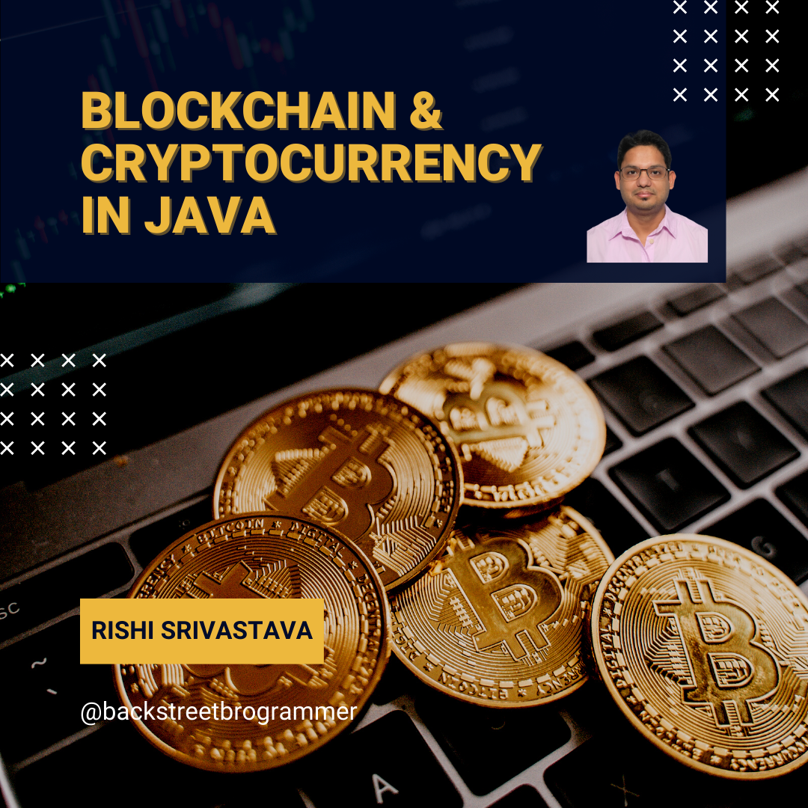

# Blockchain and Cryptocurrency in Java

> Blockchain is a peer-to-peer decentralized distributed ledger technology that makes the records of any digital asset
> transparent and unchangeable and works without involving any third-party intermediary.

In simpler words, the blockchain is an **immutable** (unchangeable, meaning a transaction or file recorded cannot be
changed) distributed digital **ledger** (digital record of transactions or data stored in multiple places on a computer
network).

An **asset** can be tangible (a house, car, cash, land) or intangible (intellectual property, patents, copyrights,
branding). Virtually anything of value can be tracked and traded on a blockchain network, reducing risk and cutting
costs for all involved.

> A cryptocurrency is a digital currency designed to work as a medium of exchange through a computer network that is
> not reliant on any central authority, such as a government or bank, to uphold or maintain it.
> It is a decentralized system for verifying that the parties to a transaction have the money they claim to have,
> eliminating the need for traditional intermediaries, such as banks, when funds are being transferred between
> two entities.

In simpler words, cryptocurrency is a digital or virtual currency that is secured by **cryptography**, which makes it
nearly impossible to counterfeit or double-spend. Many cryptocurrencies are decentralized networks based on blockchain
technology — a distributed ledger enforced by a disparate network of computers.

## Table of contents

### Part I - Blockchain

1. Blockchain - The Big Picture
2. Hash Function
3. Decentralized Ledger
4. Blockchain - Mining

_work_in_progress_

### Part II - Cryptocurrency

1. Cryptocurrency - The Big Picture
2. History of currency
3. The Forex Market
4. Mempools

_work_in_progress_

### Youtube

[Blockchain and Cryptocurrency in Java playlist](https://www.youtube.com/playlist?list=PLQDzPczdXrTjU7O6HAKDgm_mLvlDqFl3Y)

---

## Part I - Blockchain

### Blockchain - The Big Picture

#### Blockchain Demystified

Suppose I want to buy a computer from one of my colleague in my office. The colleague wants to sell it as she is moving
to other location. So, to make the transaction (buying and selling) - normal procedure is to have a centralized third
party system (like banks) where the transaction can be recorded, i.e. money transferred from my account to her account.
This transaction will be recorded as bank statements in my account and her credited bank account.

Imagine a world where I can send money directly to my colleague without a bank – in seconds instead of days, and I don’t
pay any exorbitant bank fees.

Or one where I store money in an online wallet not tied to a bank, meaning I am my own bank and have complete control
over my money. I don’t need a bank’s permission to access or move it, and never have to worry about a third party taking
it away, or a government’s economic policy manipulating it.

This is not a world of the future; it is a world that an avid but growing number of early adopters live in right now.
And these are just a few of the important blockchain technology use cases that are transforming the way we trust and
exchange value.

Blockchain technology wants to get rid of this centralized systems and make the whole transaction decentralized and
distributed. A decentralized network offers multiple benefits over the traditional centralized network, including
increased system reliability and privacy. Moreover, such networks are much easier to scale and deal with no real single
point of failure. The reason why Blockchain is distributed is because of shared communication and distributed
processing.

So me and my colleague can do the transaction in the blockchain network of computer buyers and sellers. Blockchain is
a **trust-less** system without any third party => the blockchain itself guarantees trust.

A peer-to-peer (P2P) network is a simple network of computers. Here each computer acts as a node for file sharing within
the formed network. Here each node acts as a server and thus there is no central server in the network. This allows the
sharing of a huge amount of data. The tasks are equally divided amongst the nodes. Each node connected in the network
shares an equal workload. For the network to stop working, all the nodes need to individually stop working. This is
because each node works independently.

The P2P architecture of Blockchains provides several benefits, such as greater security compared to traditional
client-server-based networks. A distributed P2P network, paired with a majority of consensus requirement, provides
Blockchains a relatively high degree of resistance to malicious activities.

